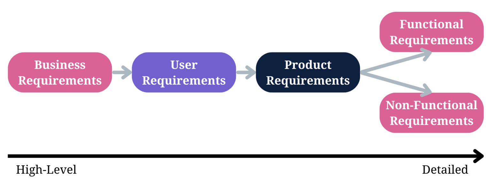

# Functional Requirements Document

Non-functional or functional requirements are often captured on product requirements documents (PRDs) or as a separate functional requirements document (FRD) or non-functional requirements document (NFRD). However, they contain the details of the end of requirements processing.
https://www.requiment.com/what-are-functional-and-non-functional-requirements/#:~:text=Non%2Dfunctional%20or%20functional%20requirements,the%20end%20of%20requirements%20processing.

However, functional requirements describe a system, its components, and the functions it must perform. On the other hand, non-functional requirements describe software systems’ quality attributes.

---------
# Capabilities for writing software FRD
 The PRD is a comprehensive document that outlines the purpose, features, functionality, and behavior of a product to guide its development. To write a good PRD, it’s important to have both theoretical knowledge and practical insights. Here's a breakdown of the **theoretical knowledge** that helps in mastering PRD writing:

### 1. **Understanding PRD Structure**
   - **Problem Statement or Purpose**: Clearly define the product’s purpose and the problem it aims to solve. This helps align the entire document with user needs and business goals.
   - **Objectives and Success Metrics**: Include measurable goals (e.g., KPIs) that define the success of the product or feature.
   - **Features and Requirements**: This section describes the features of the product in detail, which should be clear to both technical and non-technical teams.
   - **User Personas and Scenarios**: Provides context by outlining who will use the product and how they will interact with it.

Mastery here comes from understanding how to clearly **communicate** complex requirements in a simple, actionable way.

---

### 2. **Stakeholder Communication and Collaboration**
   - **Cross-functional Collaboration**: Understand the needs of all key stakeholders, including engineering, marketing, sales, and customer support teams, as well as customers themselves.
   - **RACI Matrix**: RACI stands for Responsible, Accountable, Consulted, and Informed. This helps outline who is involved at each stage of the product’s development, ensuring everyone knows their role and responsibilities.
   - **Requirements Gathering**: You need to know how to collect requirements from stakeholders. Techniques such as *interviews, focus groups*, and *workshops* can be used.

The PRD must serve as a communication tool, helping teams align on product direction and priorities.

---

### 3. **Requirements Prioritization Frameworks**
   - **MoSCoW Method**: MoSCoW stands for Must have, Should have, Could have, Won’t have. This is a popular framework for categorizing features based on their necessity.
   - **Kano Model**: A framework that helps determine which features will delight customers versus which features are simply expected.
   - **RICE Method**: This model helps rank product ideas by Reach, Impact, Confidence, and Effort. It’s especially useful when there are too many competing ideas.
   - **Value vs. Effort Matrix**: Visualize features based on the value they bring to users versus the effort it takes to implement them.

By mastering these prioritization methods, you can ensure the PRD focuses on features that provide the greatest value.

---

### 4. **User-Centered Design and UX Considerations**
   - **User Personas**: Developing personas to capture the different user types and their goals. This helps you design features that cater to their needs.
   - **User Stories**: Writing user stories like “As a [type of user], I want to [goal], so that [reason]” helps developers understand how features should behave.
   - **Wireframing and Prototyping**: You should have a basic understanding of how wireframes or prototypes can visualize and clarify requirements. Tools like Figma or Sketch can aid this.
   - **User Flows and Journey Mapping**: Understanding how to map out user flows and journeys helps capture all the touchpoints that users will go through in the product. This helps define functionality more clearly.

PRDs should be designed with the end user in mind, and every feature should tie back to the user’s needs.

---

### 5. **Non-Functional Requirements (NFRs)**
   - **Performance**: How fast does the system need to be? What are the load times, response times, or capacity targets?
   - **Scalability**: How will the product handle growth? Consider future demand, increased traffic, and larger datasets.
   - **Security**: Ensure that security requirements (e.g., data encryption, user authentication) are captured, especially in products handling sensitive information.
   - **Usability and Accessibility**: Requirements related to user interface design, accessibility standards (like WCAG), and ease of use should be defined.
   - **Reliability**: Define uptime, fault tolerance, and recovery time in case of system failure.

Non-functional requirements are often overlooked but can make or break the product’s performance and user experience.

---

### 6. **Writing Clear and Actionable Requirements**
   - **Use Simple, Unambiguous Language**: Avoid jargon or vague terms. For example, instead of writing “the system should load quickly,” specify “the system should load within 2 seconds on a 4G mobile connection.”
   - **Acceptance Criteria**: For each feature, define clear acceptance criteria (conditions that need to be met for the feature to be considered “done”). This avoids confusion later during the testing and release phases.
   - **Use Case Diagrams and Flowcharts**: Visual diagrams like *use case diagrams* and *process flowcharts* can clarify complex functionalities.
   - **SMART Criteria**: Requirements should be Specific, Measurable, Achievable, Relevant, and Time-bound to ensure they are actionable and clear to all stakeholders.

Clear and measurable requirements minimize misunderstandings and ensure alignment between teams.

---

### 7. **Traceability and Version Control**
   - **Requirements Traceability Matrix (RTM)**: A tool used to ensure that all requirements defined in the PRD are covered through development, testing, and validation. It helps track changes and ensures no requirement is missed.
   - **Version Control and Change Management**: Use tools like Confluence or Google Docs for PRD collaboration and versioning. As requirements evolve, keeping track of changes ensures that development teams stay on the same page.
   - **Backlog and Feature Grooming**: Requirements often evolve during development. Regularly grooming the product backlog ensures that features are continuously prioritized and refined based on current understanding and progress.

---

### 8. **Technical Feasibility and Constraints**
   - **Technology Stack**: You don’t need to be a developer, but understanding the technology stack (front-end, back-end, database, cloud infrastructure) helps you assess technical feasibility and constraints.
   - **APIs and Integrations**: If your product interacts with external systems, specify how those integrations should work and define any required APIs.
   - **Dependency Management**: Identify any third-party dependencies (e.g., cloud services, libraries, or frameworks) that could impact development timelines or feature capabilities.

Being mindful of technical constraints ensures that the PRD sets realistic expectations for the development team.

---

### 9. **Risk Management**
   - **Risk Identification**: You should outline potential risks (e.g., technical, regulatory, or market-related) that could impact the project’s timeline or scope.
   - **Mitigation Strategies**: Define how to mitigate these risks, such as alternative solutions or feature trade-offs if technical hurdles arise.
   - **Assumptions and Dependencies**: Document any assumptions (e.g., availability of a new technology) or dependencies (e.g., third-party tools or APIs) that could affect feature delivery.

Managing risks upfront can prevent costly surprises during development.

---

### 10. **Regulatory and Compliance Requirements**
   - **GDPR, CCPA, and Privacy Laws**: If your product deals with personal data, ensure that all requirements around data privacy and compliance are clearly outlined.
   - **Industry-Specific Regulations**: Products in healthcare, finance, or other regulated industries may have specific regulatory needs (e.g., HIPAA compliance in healthcare).
   - **Accessibility**: Define accessibility standards (e.g., ADA compliance in the U.S.) to ensure the product can be used by people with disabilities.

Compliance and regulatory issues need to be incorporated early into the product’s requirements to avoid costly changes later.

---

### Conclusion: Key Theoretical Frameworks for PRD Writing

1. **MoSCoW, RICE, and Kano Models**: For prioritization of features.
2. **User Stories, Use Case Diagrams**: For defining how the product should behave in real-life user interactions.
3. **Acceptance Criteria and SMART Goals**: For writing clear and actionable requirements.
4. **Non-functional Requirement (NFR) Frameworks**: Covering performance, scalability, security, and usability.
5. **Risk Management and RTM**: Ensuring traceability and risk mitigation throughout the project.

By mastering these theoretical concepts, you can write PRDs that guide the product development team effectively and help ensure the product meets both user needs and business goals.

Would you like an example of a well-structured PRD template or help writing specific sections of a PRD? Let me know!

# Role of FDR writing

Certainly! Below is a detailed description of a role that is highly skilled in writing software functional development requirements:

### 1. Role Capabilities

**Core Skills and Abilities:**

- **Requirement Analysis and Documentation**: The ability to gather, analyze, and document business needs and translate them into clear and actionable functional development requirements. This involves creating detailed specifications that guide the development team effectively.

- **Business and Technical Workflow Understanding**: A deep understanding of both business processes and technical workflows is crucial. This ensures that the requirements align with business objectives and are technically feasible.

- **Communication Skills**: Exceptional verbal and written communication skills to articulate requirements to both technical and non-technical stakeholders. This includes facilitating meetings, conducting interviews, and leading workshops to gather input.

- **Problem-Solving and Analytical Thinking**: Strong analytical skills to evaluate complex information from multiple sources and distill it into actionable insights. The ability to foresee potential issues and propose solutions is also important.

- **Collaboration and Teamwork**: Ability to work collaboratively with cross-functional teams, including developers, project managers, UX/UI designers, and business stakeholders. This includes coordinating efforts to ensure that requirements are met and projects are delivered successfully.

- **Attention to Detail**: High attention to detail to ensure that all aspects of the requirements are captured accurately and comprehensively.

- **Adaptability and Flexibility**: Ability to adapt to changing environments and requirements, and to manage multiple projects simultaneously.

### 2. Qualifications

**Educational Background:**

- **Bachelor’s Degree**: Typically in Computer Science, Information Systems, Business Administration, or a related field. This provides a foundational understanding of both technical and business concepts.

- **Advanced Degrees (Optional)**: A Master’s degree in Business Administration (MBA) or Information Technology can be advantageous for more senior roles.

**Certifications:**

- **Certified Business Analysis Professional (CBAP)**: This certification is widely recognized and demonstrates expertise in business analysis.

- **Project Management Professional (PMP)**: While not specific to business analysis, this certification can be beneficial for understanding project management principles.

- **Agile Certifications**: Certifications such as Certified Scrum Master (CSM) or PMI Agile Certified Practitioner (PMI-ACP) can be valuable, especially if the organization uses Agile methodologies.

### 3. Experience

**Ideal Experience:**

- **Years of Experience**: Typically, 5-7 years of experience in writing functional specifications and requirements. This includes experience in various stages of the software development lifecycle.

- **Cross-Functional Team Collaboration**: Proven experience working with cross-functional teams, including developers, stakeholders, and project managers, to ensure alignment and successful delivery of projects.

- **Industry Exposure**: Experience in diverse industries can be beneficial, as it provides a broader perspective and understanding of different business models and processes.

- **Project Diversity**: Experience with a variety of project types, such as web applications, mobile apps, and enterprise systems, is advantageous. This diversity helps in understanding different technical requirements and constraints.

- **Tool Proficiency**: Familiarity with requirement management tools (e.g., JIRA, Confluence, Trello) and documentation tools (e.g., Microsoft Office Suite, Google Workspace) is often required.

This role is crucial in bridging the gap between business needs and technical execution, ensuring that software development projects meet business objectives efficiently and effectively.