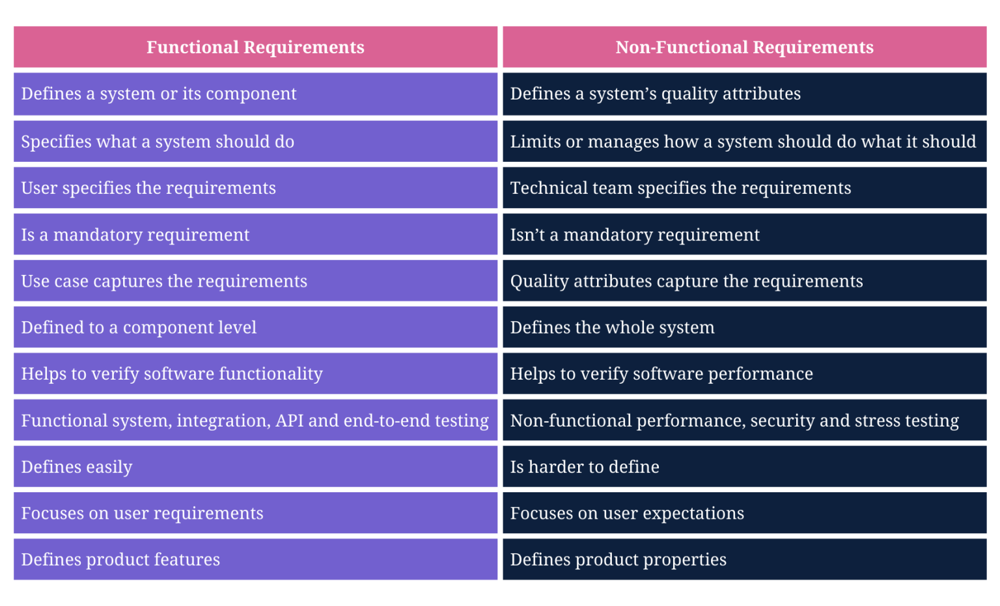

# Functional Requirements Document

Non-functional or functional requirements are often captured on product requirements documents (PRDs) or as a separate functional requirements document (FRD) or non-functional requirements document (NFRD). However, they contain the details of the end of requirements processing.
https://www.requiment.com/what-are-functional-and-non-functional-requirements/#:~:text=Non%2Dfunctional%20or%20functional%20requirements,the%20end%20of%20requirements%20processing.

However, functional requirements describe a system, its components, and the functions it must perform. On the other hand, non-functional requirements describe software systems’ quality attributes.

